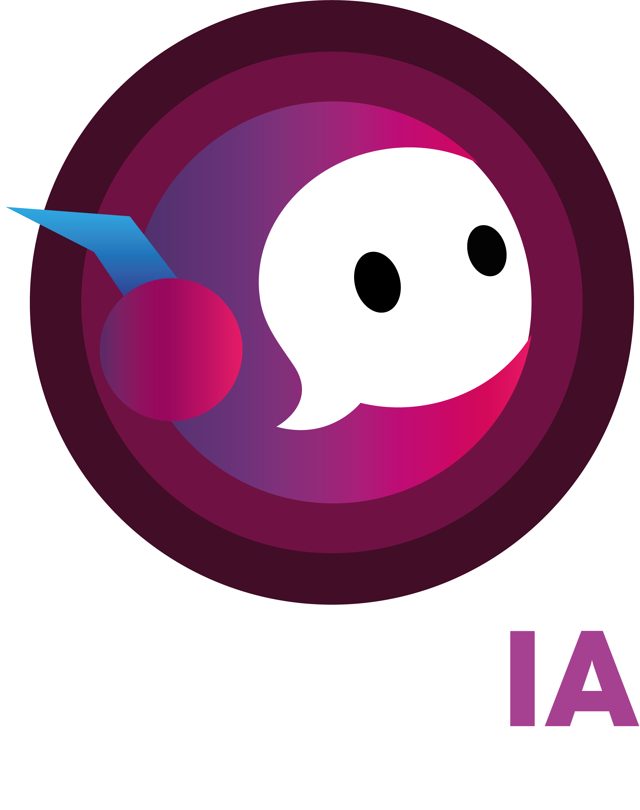

# abbemIA - Transforma la interacción, eleva tu negocio.

AbbenIA es una solución innovadora de inteligencia artificial diseñada para transformar la interacción entre empresas y sus clientes a través de chatbots inteligentes y altamente personalizados. Nuestro enfoque combina lo último en procesamiento de lenguaje natural y aprendizaje automático para ofrecer una experiencia de usuario inigualable, optimizando tanto la eficiencia operativa como la satisfacción del cliente.

 ## Características clave
- **Tecnología Avanzada:** Algoritmos de IA para manejar interacciones complejas, mejorando la eficiencia operativa.
- **Personalización:** Chatbots altamente adaptables a las necesidades específicas de cada empresa.
- **Escalabilidad:** Permite escalar operaciones sin perder calidad de servicio.
- **Atención Multicanal:** Los chatbots pueden operar en múltiples canales, incluyendo sitios web, redes sociales y aplicaciones móviles.
- **Integración Sencilla:** Fácil integración con sistemas y plataformas ya existentes en las empresas
- **Innovación Continua:** Compromiso con la mejora constante y mantenerse a la vanguardia tecnológica.

## Misión
Empoderamos a las empresas con soluciones de chatbots inteligentes y personalizados, transformando la manera en que gestionan sus operaciones, interactúan con sus clientes y cuidan de sus empleados. Nos comprometemos a integrar inteligencia artificial avanzada en cada interacción, optimizando procesos, mejorando la experiencia del usuario y fomentando un entorno de trabajo más eficiente y satisfactorio. A través de nuestras innovadoras tecnologías de chatbot, aspiramos a ser el aliado estratégico que impulsa el crecimiento sostenible y la evolución continua de las empresas en la era digital, guiados por un compromiso inquebrantable con la innovación, la excelencia y la ética.

## Visión
Ser la empresa líder en innovación de chatbots con inteligencia artificial, reconocida por transformar el servicio al cliente a nivel global. Aspiramos a redefinir la manera en que las empresas se conectan con sus clientes, impulsando un futuro donde la inteligencia artificial sea el estándar en la gestión de la atención al cliente, superando consistentemente las expectativas de nuestros clientes.

## Logo

## Documentación
- Análisis Foda: abbemIA
- Cultura abbemIA

## Integrantes
- CEO: Bryan Emmanuel Cetzal Ceme.
- Bennen Alexandre Tun Ek.
- Abraham Raymundo Cruz Colli.
